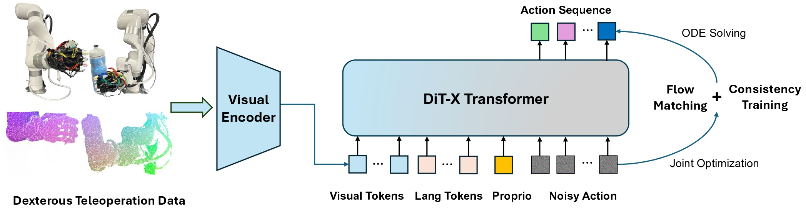

# ManiFlow: A Dexterous Manipulation Policy via Consistency Flow Training (CoRL 2025)

<div align="center">
  
</div>

---

## 🔥 Overview

ManiFlow is a **visual imitation learning algorithm** for dexterous robotic manipulation using Flow Matching with a consistency training objective. Our approach enables efficient learning of high-dimensional dexterous behavior across multiple robot platforms.

### Key Achievements
- **60+ simulation tasks** validated
- **8 real-world scenarios** tested  
- **98.3% improvement** over existing approaches in real-world settings
- **Multi-platform support**: Franka, bimanual Ability hands, and Unitree H1 humanoid robot with Inspire hands

---

## 📋 Table of Contents
- [Installation](#installation)
- [Data Preparation](#data-preparation)
- [Training](#training)
- [Evaluation](#evaluation)
- [Repository Status](#repository-status)
- [Contact](#contact)

---

## 🛠️ Installation

### Prerequisites
- Docker installed on your system
- AWS CLI configured (for data download)

### Setup Steps
1. **Clone and navigate to the repository**
   ```bash
   cd YOUR_PATH_TO_RoboTwin
   ```

2. **Build the Docker image**
   ```bash
   cd Docker
   bash BUILD_DOCKER_IMAGE.sh
   ```

3. **Configure and run the container (only run once)**
   ```bash
   # ⚠️ Important: Update $LOCAL_PATH in these scripts to your repo path
   # Edit RUN_DOCKER_CONTAINER.sh and initialize-docker-container.sh
   # Add WANDB_API_KEY in initialize-docker-container.sh if you want to use Weights & Biases
   bash RUN_DOCKER_CONTAINER.sh
   ```

4. **Enter the container**
   ```bash
   # For subsequent runs
   docker exec -it robotwin_container bash
   cd YOUR_PATH_TO_RoboTwin  # Should match $LOCAL_PATH from step 3
   ```

---

## 📊 Data Preparation

You have two options for obtaining training data:

### Option 1: Use Pre-processed Data (Recommended)
Download our pre-processed dataset from AWS S3:

```bash
# Set your data directory path
DATA_DIR=/home/geyan/projects/RoboTwin/policy/ManiFlow/data  # Update to your path

# Download pre-processed data (excludes outputs folder)
aws s3 sync s3://tri-ml-datasets/robotwin/maniflow_zarr_data/ $DATA_DIR/ --exclude "outputs/*"
```

### Option 2: Collect and Process Your Own Data
If you want to collect custom data:

```bash
# Download RoboTwin assets
bash script/_download_assets.sh

# 1. Collect demonstration data
bash collect_data.sh lift_pot demo_randomized 0
# Parameters: <task_name> <demo_type> <seed>

# 2. Process collected data into zarr format
cd policy/ManiFlow
bash process_data.sh lift_pot demo_randomized 50
# Parameters: <task_name> <demo_type> <num_demos>
```

---

## 🚀 Training

### Quick Start
```bash
# Navigate to ManiFlow directory
cd policy/ManiFlow

# Train a ManiFlow policy with single GPU
bash train_eval_demo.sh lift_pot robot_maniflow demo_randomized 50 addi_info 0 0

# Train a ManiFlow policy with multiple GPUs (DDP), e.g., use 2 GPUs 0 and 1
bash train_eval_ddp_demo.sh lift_pot robot_maniflow demo_randomized 50 addi_info 0 0_1

```

### Training Parameters
| Parameter | Description | Example |
|-----------|-------------|---------|
| Task | Task name to train on | `lift_pot` |
| Method | Algorithm variant | `robot_maniflow` |
| Demo Type | Type of demonstrations | `demo_randomized` |
| Num Demos | Number of demonstrations | `50` |
| Additional Info | Extra configuration | `addi_info` |
| Seed | Random seed | `0` |
| GPU ID | GPU device ID | `0` |

### Training Configuration
- Set `$train=true` in the script to enable training
- Monitor training progress on Weights & Biases (configure `WANDB_API_KEY` in `initialize-docker-container.sh`)

---

## 📈 Evaluation

### Automatic Evaluation
Remember to download the RoboTwin assets first as in [Data Preparation](#data-preparation)
```bash
# Set $train=false and $eval=true in train_eval_demo.sh 
# or set $train and $eval both to true and it will run training and evaluation sequentially
bash train_eval_demo.sh lift_pot robot_maniflow demo_randomized 50 addi_info 0 0
```

### View Results
- **Evaluation videos**: Check the outputs directory
  ```bash
  # Example output path
  /home/geyan/projects/RoboTwin/policy/ManiFlow/data/outputs/lift_pot-robot_maniflow-addi_info_seed0
  ```
- **Metrics**: Available on your Weights & Biases dashboard during training

---
### Error Catching
For common errors and their fixes, refer to the [ERROR_CATCH.md](ERROR_CATCH.md) file.

---

## ⚠️ Repository Status

> **Note**: This is an **initial development version** of ManiFlow.  
> Expect ongoing improvements including:
> - Additional testing and validation
> - Code cleanup and optimization  
> - Enhanced documentation
> - New features and capabilities

---

## 📧 Contact

For questions, issues, or collaboration inquiries:
- **Open an issue** in this repository
- **Reach out directly** to [Ge Yan](https://geyan21.github.io/)

---

<div align="center">
  <i>🤖 Advancing the frontier of dexterous robotic manipulation</i>
</div>