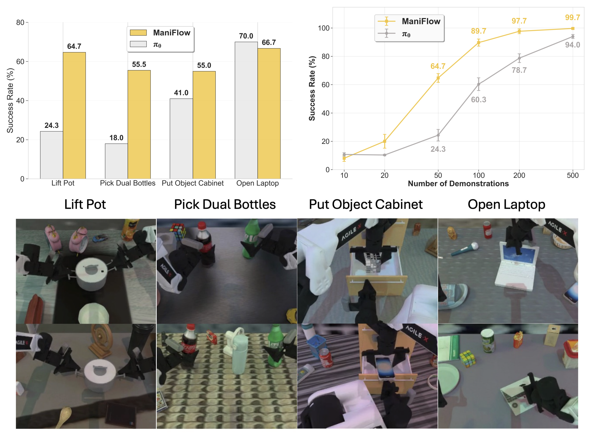

# ManiFlow: A General Robot Manipulation Policy via Consistency Flow Training

<div align="center">
  
</div>

## 🔥 Overview

ManiFlow is a visuomotor imitation learning policy for general robot manipulation that generates precise, high-dimensional, and dexterous actions from visual, language, and proprioceptive inputs. It features a general architecture supporting both 2D and 3D inputs, combines flow matching with consistency training for 1-2 step inference, and demonstrates strong scaling behavior and generalization across diverse robots and environments.

Unlike the large-scale pre-trained π0, ManiFlow is trained from scratch with point cloud input — yet it shows **superior efficiency**, **robustness** and **strong scaling capability** with demonstrations:

- On the RoboTwin 2.0 benchmark, ManiFlow consistently outperforms π0 on bimanual dexterous tasks, even under heavy domain randomization (clutter, novel objects, diverse backgrounds, lighting changes, table height shifts).

- With only 50 demonstrations per task, ManiFlow maintains high success rates across these challenging conditions, demonstrating strong learning efficiency and generalization.

- From 10 to 500 demos on the single task, ManiFlow consistently outperforms π0. It scales smoothly with more data, reaching >99% success on a single task and surpassing π0 in both low-data and large-scale regimes

In this codebase, we provide support for training and evaluating [ManiFlow policy](https://github.com/geyan21/ManiFlow_Policy) on the [RoboTwin2.0](https://github.com/robotwin-Platform/RoboTwin) platform.

---

## 📋 Table of Contents
- [Installation](#-installation)
- [Data Preparation](#-data-preparation)
- [Training and Evaluation](#-training-and-evaluation)

---

## 🛠️ Installation

You can set up and run ManiFlow in the RoboTwin environment using either **Conda** or **Docker**.  
- For Docker setup instructions, see the [Docker guide](Docker.md).  
- For Conda setup instructions, see the [INSTALL guide](INSTALL.md).


### Download Assets
```bash
cd RoboTwin # go back to the root folder of RoboTwin
bash script/_download_assets.sh
```

---

## 📊 Data Preparation

```bash

# 1. Collect demonstration data
cd RoboTwin
bash collect_data.sh lift_pot demo_randomized 0
# Parameters: <task_name> <demo_type> <gpu_id>

# 2. Process collected data into zarr format
cd policy/ManiFlow
bash process_data.sh lift_pot demo_randomized 50
# Parameters: <task_name> <demo_type> <num_demos>
```

---

## 🚀 Training and Evaluation

```bash
# The training scripts are located in policy/ManiFlow
# Train a ManiFlow pointcloud policy on the lift_pot task in RoboTwin
cd RoboTwin/policy/ManiFlow/scripts
bash train_eval_robotwin2.sh lift_pot maniflow_pointcloud_policy_robotwin2 demo_randomized 50 1004 0 0

# Train a ManiFlow image policy on the lift_pot task in RoboTwin
bash train_eval_robotwin2.sh lift_pot maniflow_image_timm_policy_robotwin2 demo_randomized 50 1004 0 0
```
### Script Parameters
For more details about the parameters in the training script `train_eval_robotwin2.sh`, please refer to the comments in the script. Here are some key parameters:
- Set `$train=true` in the script to enable training
- Set `$eval=true` in the script to enable evaluation after training
- `$train_task_config` is the training data type, which can be `demo_clean` or `demo_randomized`
- `$eval_task_config` is the evaluation environment type you want to test on, which can be `demo_clean` or `demo_randomized`

---

Note that RoboTwin 2.0 has been actively updated from the original RoboTwin introduced in the ManiFlow paper. As a result, some performance numbers may differ between the paper and the current RoboTwin 2.0 benchmark, though the overall conclusions should remain consistent.